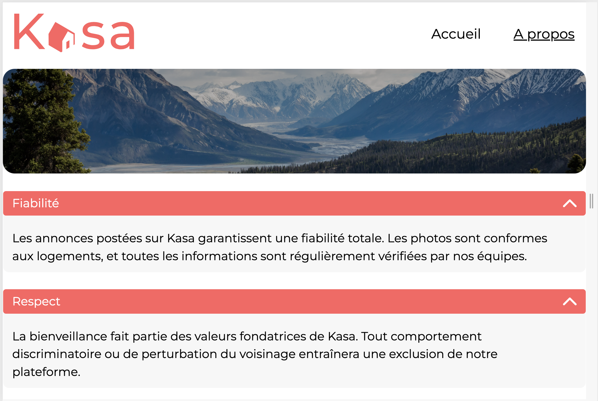
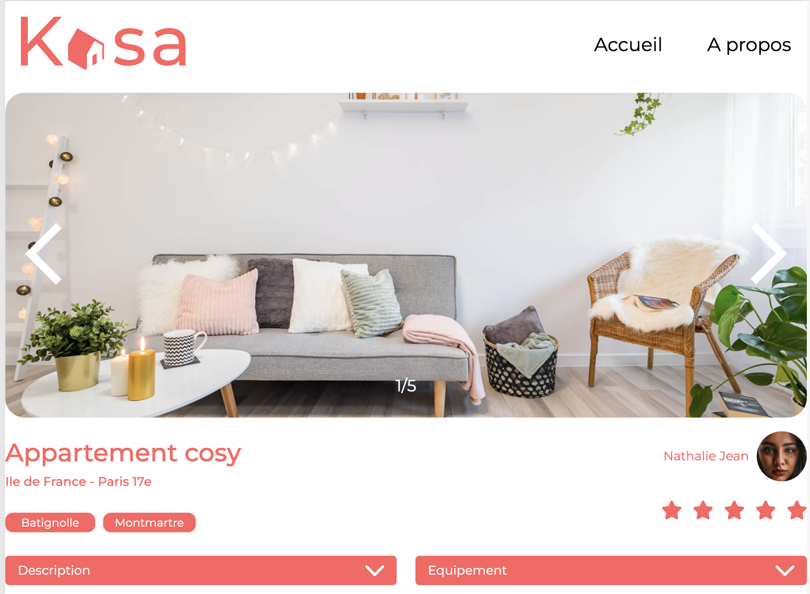

Openclassrooms Projet 11 : Développez une application Web avec React et React Router - Site KASA





Le contexte du projet :

- Mon profil : Développeur Freelance missionné par l'entreprise -Kasa- en tant que Développeur Front-end.
- L’entreprise : leaders de la location d’appartements entre particuliers en France.
- La mission : refonte totale du site agé de 10 ans pour passer à une stack complète en JS (NodeJs - React) avec de nouvelles maquettes.
- L’objectif : démarrer le projet React et développer l’ensemble de l’application, les composants React, les routes React Router, en suivant les maquettes Figma (responsives ).

Cahier des charges :

- Spécifications techniques :

  - React :
    - Découpage en composants modulaires et réutilisables
    - Un composant par fichier
    - Structure logique des différents fichiers
    - Utilisation des props entre les composants
    - Utilisation du state dans les composants quand c'est nécessaire
    - Gestion des événements
    - Listes
  - React Router :

    - Les paramètres des routes sont gérés par React Router dans l'URL pour récupérer les informations de chaque logement.
    - Il existe une page par route.
    - La page 404 est renvoyée pour chaque route inexistante, ou si une valeur présente dans l’URL ne fait pas partie des données renseignées.
    - La logique du routeur est réunie dans un seul fichier.

    ### Arborescence du projet

    Voici l'arborescence du projet :

    ```
    /Users/antonin/OC/Projets/kasa/
    ├── public/
    ├── src/
    │   ├── assets/
    │   ├── components/
    │   ├── pages/
    │   ├── App.jsx
    │   ├── main.jsx
    │   └── ...
    ├── .gitignore
    ├── package.json
    ├── README.md
    └── ...
    ```

    ### Mise en route du site React avec Vite

    Pour démarrer le projet, suivez les étapes ci-dessous :

    1. **Cloner le dépôt** :

       ```bash
       git clone <URL_DU_DEPOT>
       cd kasa
       ```

    2. **Installer les dépendances** :

       ```bash
       npm install
       ```

    3. **Démarrer le serveur de développement** :

       ```bash
       npm run dev
       ```

    4. **Accéder à l'application** :
       Ouvrez votre navigateur et allez à l'adresse `http://localhost:5173`.

    ### Scripts disponibles

    - `npm run dev` : Démarre le serveur de développement.
    - `npm run build` : Génère une version optimisée pour la production.
    - `npm run serve` : Sert la version optimisée pour la production.

    ### Dépendances principales

    - **React** : Bibliothèque JavaScript pour construire des interfaces utilisateur.
    - **React Router** : Bibliothèque pour gérer les routes dans une application React.
    - **Vite** : Outil de build rapide pour les projets front-end modernes.

    ### Structure des dossiers

    - **public/** : Contient les fichiers statiques.
    - **src/** : Contient le code source de l'application.
      - **assets/** : Contient les images et autres ressources.
      - **components/** : Contient les composants React réutilisables.
      - **pages/** : Contient les différentes pages de l'application.
      - **App.jsx** : Composant principal de l'application.
      - **main.jsx** : Point d'entrée de l'application.

    ### Configuration de l'environnement

    Assurez-vous d'avoir Node.js et npm installés sur votre machine. Vous pouvez les télécharger depuis [nodejs.org](https://nodejs.org/).

    ### Déploiement

    Pour déployer l'application, générez une version optimisée pour la production avec la commande `npm run build`, puis servez les fichiers générés à partir du dossier `dist`.
